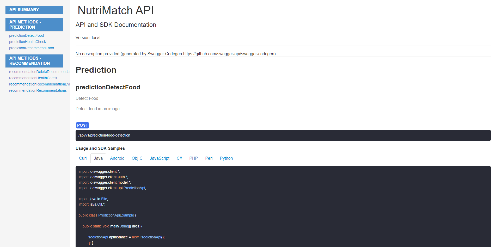

<div>
  <h1 align="center">Nutrimatch Backend</h1>
  <h3>Skills showcase project using AI to get recommendations based on photos or pictures of food</h3>
</div>

<div align="center">
  <a href="https://github.com/Dylan-Chambi/nutrimatch-mobile/blob/main/LICENSE"></a>
</div>

<br/>

Nutrimatch is a personal project that uses AI to get recommendations based on photos or pictures of food. This project is a showcase of skills and is not intended to be used in production, but rather to show my skills in the field of AI and rest api backend development.

## Features 🚀

- **Firebase Admin Auth** Authentication and user management.
- **OpenAI API:** Utilization of the OpenAI API to get predictions based on user input.
- **Vision Model:** Use of GPT-4 Vision model to get predictions based on custom images.
- **Use of new technologies:** Utilization of newly released technologies like Truelens and GPT Vision.
- **Database Connection:** Connection to a database to store user data and recommendations.
- **Images Storage:** Storage of images in a cloud storage service.
- **Image conversion:** Conversion of images to webp format to reduce storage space.
- **Automatic Documentation Deployment:** Automatic deployment of documentation using swagger auto generation, and deploy to github pages.

## API Documentation Webpage 📖

You can access the API documentation webpage by clicking on the badge below:

[](https://dylan-chambi.github.io/nutrimatch-backend/)

<div align="center">
  <a href="https://dylan-chambi.github.io/nutrimatch-backend/"></a>
</div>

## Tech Stack 💻

- [FastAPI](https://fastapi.tiangolo.com/) – Web framework
- [OpenAI API](https://platform.openai.com/docs/) – The most powerful Large Language Model
- [Firebase](https://firebase.google.com/) – Authentication and Storage
- [MongoDB](https://www.mongodb.com/) – Database
- [Trulens](https://www.trulens.org/) – LLMs tracking and monitoring
- [Pydantic](https://pydantic-docs.helpmanual.io/) – Data validation and settings management
- [Pillow](https://pillow.readthedocs.io/en/stable/) – Image processing
- [OpenAPI](https://swagger.io/specification/) – API documentation
- [Github Actions](https://docs.github.com/en/actions) – CI/CD pipeline

## Getting Started 🏁

### Prerequisites ✔️

Here's what you need to get started with this project:

- [Python 3.11+](https://www.python.org/downloads/)
- [Pip](https://pip.pypa.io/en/stable/installation/)
- [MongoDB Cluster](https://www.mongodb.com/cloud/atlas)
- [Firebase Project](https://firebase.google.com/)
- [OpenAI API Key](https://platform.openai.com/account/api-keys)

### Installation Steps 🛠️

#### **1. Clone the repository**

```shell
git clone https://github.com/Dylan-Chambi/nutrimatch-backend.git
cd nutrimatch-backend
```

#### **2. Install python dependencies**

```shell
pip install -r requirements.txt
```

#### **3. Create a Firebase project**

> If you don't have a Firebase project, follow these steps to create one:

1. Go to the [Firebase Console](https://console.firebase.google.com/).
2. Sign in with your Google account.
3. Click on "Add project".
4. Follow the steps to create a new project.

> [Learn More](https://firebase.google.com/docs/projects/learn-more)

#### **4. Create a Service Account**

1. Go to the [Firebase Console](https://console.firebase.google.com/).
2. Select your project.
3. Go to "Project settings".
4. Click on the "Service accounts" tab.
5. Click on "Generate new private key".
6. Download the JSON file. (serviceAccountKey.json)

#### **5. Create a MongoDB Cluster**

> If you don't have a MongoDB cluster, follow these steps to create one:

1. Go to the [MongoDB Cloud](https://www.mongodb.com/cloud/atlas).
2. Sign in with your account.
3. Click on "Build a New Cluster".
4. Follow the steps to create a new cluster.

> [Learn More](https://docs.atlas.mongodb.com/getting-started/)

#### **6. Get the MongoDB connection string**

1. Go to the [MongoDB Cloud](https://www.mongodb.com/cloud/atlas).
2. Select your project.
3. Click on "Connect".
4. Choose the "Drivers" option.
5. Select the "Python" driver.
6. Copy the connection string, replace `<password>` with your password.

#### **7. Create a .env file**

```shell
touch .env
```

Add the following environment variables to the .env file:

```shell
OPENAI_KEY=<YOUR_OPENAI_KEY>
FIREBASE_TYPE=<YOUR_FIREBASE_TYPE>
FIREBASE_PROJECT_ID=<YOUR_FIREBASE_PROJECT_ID>
FIREBASE_PRIVATE_KEY_ID=<YOUR_FIREBASE_PRIVATE_KEY_ID>
FIREBASE_PRIVATE_KEY=<YOUR_FIREBASE_PRIVATE_KEY>
FIREBASE_CLIENT_EMAIL=<YOUR_FIREBASE_CLIENT_EMAIL>
FIREBASE_CLIENT_ID=<YOUR_FIREBASE_CLIENT_ID>
FIREBASE_AUTH_URI=<YOUR_FIREBASE_AUTH_URI>
FIREBASE_TOKEN=URI=<YOUR_FIREBASE_TOKEN_URI>
FIREBASE_AUTH_PROVIDER_X509_CERT_URL=<YOUR_FIREBASE_AUTH_PROVIDER_X509_CERT_URL>
FIREBASE_CLIENT_X509_CERT_URL=<YOUR_FIREBASE_CLIENT_X509_CERT_URL>
FIREBASE_UNIVERSE_DOMAIN=<YOUR_FIREBASE_UNIVERSE_DOMAIN>
FIREBASE_STORAGE_BUCKET=<YOUR_FIREBASE_STORAGE_BUCKET>
MONGODB_URI=<YOUR_MONGODB_URI>
```

#### **8. Run the server**

```shell
uvicorn app:app --port=<PORT> --host=<HOST> --reload
```

## Project Structure 📂
```
|───app.py
│───LICENSE
│───README.md
│───requirements.txt
└───src
    ├───config
    ├───controller
    ├───middleware
    ├───model
    ├───predictor
    ├───routers
    │   └───v1
    │       └───endpoints
    ├───schema
    ├───service
    │   ├───firebase
    │   └───mongodb
    ├───template
    ├───trulens
    └───util
```

## License 📝

This project is licensed under the AGPLv3 License - see the [LICENSE](LICENSE) file for details.

## Author 👨‍💻

<p align="center">
  <a href="https://github.com/Dylan-Chambi">
  
  <p align="center">Dylan Chambi</p>
  </a>
</p>
